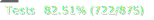
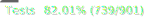
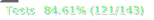

# kuromoji.ts

[]() []() []()
   

<!-- [](https://badge.fury.io/js/kuromoji) -->

TypeScriptで実装された形態素解析ライブラリです。  
JavaScriptで実装された[kuromoji.js](https://github.com/takuyaa/kuromoji.js)から移植されました。

実際の動作は[デモページ](https://MijinkoSD.github.io/kuromoji.ts/index.html)から確認することが出来ます。

## ディレクトリ構造

```
demo/         -- デモページ
dict/         -- tokenizer用の辞書データ (gunzipで圧縮済み)
dist/         -- JavaScriptにトランスパイル済みのソースコード
docs/         -- README.md用の画像データ
src/          -- TypeScriptのソースコード
test/         -- 単体テスト
```

## 使用方法

[使用方法](/docs/usage-ja.md)を参照。

## API

tokenize()が返すJSONの値は以下のようになっています。

```js
[
  {
    word_id: 509800, // 辞書内での単語ID
    word_type: "KNOWN", // 単語タイプ(辞書に登録されている単語ならKNOWN, 未知語ならUNKNOWN)
    word_position: 1, // 単語の開始位置
    surface_form: "黒文字", // 表層形
    pos: "名詞", // 品詞
    pos_detail_1: "一般", // 品詞細分類1
    pos_detail_2: "*", // 品詞細分類2
    pos_detail_3: "*", // 品詞細分類3
    conjugated_type: "*", // 活用型
    conjugated_form: "*", // 活用形
    basic_form: "黒文字", // 基本形
    reading: "クロモジ", // 読み
    pronunciation: "クロモジ", // 発音
  },
];
```

これらは[src/util/IpadicFormatter.ts](/src/util/IpadicFormatter.ts)で定義されています。
